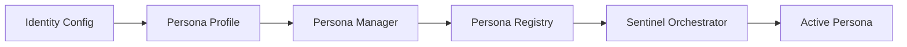

# Persona Profile Module

The `empirica.core.persona.persona_profile` module defines the core data structures for AI personas in Empirica's Phase 3 architecture.

## Overview

Persona profiles enable:
- **Epistemic priors**: Starting knowledge state for AI agents
- **Decision thresholds**: When to investigate, when to act
- **Custom weights**: How to compute composite confidence
- **Domain focus**: Areas of expertise and specialization
- **Capability management**: What each persona can do
- **Sentinel configuration**: How personas are managed and orchestrated

## Classes

### SigningIdentityConfig

**Module**: `empirica.core.persona.persona_profile`

**Purpose**: Configuration for persona's cryptographic identity and reputation

**Attributes**:
- `user_id` (`str`): Unique identifier for the persona
- `identity_name` (`str`): Human-readable name for the persona
- `public_key` (`str`): Cryptographic public key for identity verification
- `reputation_score` (`float`, default=0.5): Reputation score (0.0-1.0)

**Methods**:

#### `to_dict() -> Dict`

**Purpose**: Serialize configuration to dictionary

**Returns**: Dictionary representation of the configuration

**Example**:
```python
from empirica.core.persona.persona_profile import SigningIdentityConfig

# Create identity config
identity = SigningIdentityConfig(
    user_id="persona-123",
    identity_name="research-analyst",
    public_key="-----BEGIN PUBLIC KEY-----\nMFwwDQYJKoZIhvcNAQEBBQADSwAwSAJBAN...",
    reputation_score=0.85
)

# Serialize to dict
identity_dict = identity.to_dict()
print(identity_dict)
```

**Related**:
- `SigningPersona` - Full persona signing implementation
- `IdentityManager` - Identity management system

---

### EpistemicConfig

**Module**: `empirica.core.persona.persona_profile`

**Purpose**: Epistemic configuration defining persona's knowledge state and decision-making parameters

**Attributes**:
- `priors` (`Dict[str, float]`): Prior epistemic state (13 vectors)
- `thresholds` (`Dict[str, float]`): Decision thresholds for actions
- `weights` (`Dict[str, float]`): Tier weights for composite confidence

**Default Thresholds**:
```python
{
    "uncertainty_trigger": 0.4,      # Trigger investigation at this uncertainty level
    "confidence_to_proceed": 0.75,   # Minimum confidence to proceed with actions
    "signal_quality_min": 0.6,       # Minimum signal quality to consider
    "engagement_gate": 0.6           # Minimum engagement level required
}
```

**Default Weights**:
```python
{
    "foundation": 0.35,      # 35% weight to foundation tier
    "comprehension": 0.25,   # 25% weight to comprehension tier
    "execution": 0.25,       # 25% weight to execution tier
    "engagement": 0.15       # 15% weight to engagement tier
}
```

**Example**:
```python
from empirica.core.persona.persona_profile import EpistemicConfig

# Create epistemic configuration
epistemic_config = EpistemicConfig(
    priors={
        "know": 0.8,
        "uncertainty": 0.2,
        "clarity": 0.85,
        "confidence": 0.8,
        "understanding": 0.9,
        "familiarity": 0.75,
        "complexity": 0.3,
        "difficulty": 0.2,
        "effort": 0.6,
        "progress": 0.0,
        "satisfaction": 0.8,
        "fatigue": 0.1,
        "engagement": 0.85
    },
    thresholds={
        "uncertainty_trigger": 0.3,  # More sensitive to uncertainty
        "confidence_to_proceed": 0.8  # Higher confidence required
    }
)
```

**Usage Context**:
- Defines persona's starting knowledge state
- Configures when persona should investigate vs proceed
- Sets weights for computing composite confidence scores

**Related**:
- `CanonicalEpistemicAssessor` - Epistemic assessment system
- `MetacognitiveCascade` - Decision-making framework

---

### SentinelConfig

**Module**: `empirica.core.persona.persona_profile`

**Purpose**: Configuration for Sentinel-based persona orchestration

**Attributes**:
- `escalation_triggers` (`List[EscalationTrigger]`): Conditions for escalation
- `arbitration_strategy` (`str`): Strategy for conflict resolution
- `composition_strategy` (`str`): Strategy for vector composition
- `domain_focus` (`List[str]`): Primary domains of expertise
- `capabilities` (`List[str]`): Supported capabilities

**Example**:
```python
from empirica.core.persona.persona_profile import SentinelConfig, EscalationTrigger

# Create sentinel configuration
sentinel_config = SentinelConfig(
    escalation_triggers=[
        EscalationTrigger(
            condition="uncertainty > 0.6",
            action="escalate_to_sentinel",
            priority="high"
        )
    ],
    arbitration_strategy="domain_weighted",
    composition_strategy="weighted_average",
    domain_focus=["documentation", "knowledge_management", "software_architecture"],
    capabilities=["documentation", "analysis", "planning"]
)
```

**Related**:
- `SentinelOrchestrator` - Sentinel orchestration system
- `ArbitrationStrategy` - Conflict resolution strategies

---

### CapabilitiesConfig

**Module**: `empirica.core.persona.persona_profile`

**Purpose**: Configuration of persona's capabilities and constraints

**Attributes**:
- `supported_capabilities` (`List[str]`): List of supported capabilities
- `constraints` (`Dict[str, Any]`): Operational constraints
- `quality_thresholds` (`Dict[str, float]`): Quality standards

**Example**:
```python
from empirica.core.persona.persona_profile import CapabilitiesConfig

# Create capabilities configuration
capabilities = CapabilitiesConfig(
    supported_capabilities=[
        "documentation",
        "code_analysis",
        "planning",
        "research"
    ],
    constraints={
        "max_tokens": 4000,
        "response_time": 30.0,
        "concurrency_limit": 3
    },
    quality_thresholds={
        "documentation": 0.85,
        "code_analysis": 0.8,
        "planning": 0.9
    }
)
```

**Related**:
- `PersonaManager` - Capability management
- `TaskDecomposition` - Task breakdown by capability

---

### PersonaProfile

**Module**: `empirica.core.persona.persona_profile`

**Purpose**: Complete persona profile combining all configurations

**Attributes**:
- `identity` (`SigningIdentityConfig`): Identity configuration
- `epistemic` (`EpistemicConfig`): Epistemic configuration
- `sentinel` (`SentinelConfig`): Sentinel configuration
- `capabilities` (`CapabilitiesConfig`): Capabilities configuration
- `metadata` (`Dict[str, Any]`): Additional metadata

**Methods**:

#### `get_type() -> str`

**Purpose**: Get persona type based on capabilities and configuration

**Returns**: Persona type string (e.g., "documentation_specialist")

**Example**:
```python
from empirica.core.persona.persona_profile import PersonaProfile

# Create complete persona profile
profile = PersonaProfile(
    identity=SigningIdentityConfig(...),
    epistemic=EpistemicConfig(...),
    sentinel=SentinelConfig(...),
    capabilities=CapabilitiesConfig(...),
    metadata={
        "version": "1.0",
        "created": "2025-12-20",
        "creator": "system"
    }
)

# Get persona type
persona_type = profile.get_type()
print(f"Persona type: {persona_type}")
```

---

## Usage Patterns

### Creating a Documentation Specialist Persona

```python
from empirica.core.persona.persona_profile import (
    PersonaProfile, SigningIdentityConfig, EpistemicConfig,
    SentinelConfig, CapabilitiesConfig, EscalationTrigger
)

# Identity configuration
identity = SigningIdentityConfig(
    user_id="doc-specialist-001",
    identity_name="documentation_specialist",
    public_key="...public_key_here...",
    reputation_score=0.9
)

# Epistemic configuration (high clarity, low uncertainty for documentation)
epistemic = EpistemicConfig(
    priors={
        "know": 0.9,           # High domain knowledge
        "uncertainty": 0.1,    # Low uncertainty
        "clarity": 0.95,       # High clarity
        "confidence": 0.9,     # High confidence
        "understanding": 0.95, # Deep understanding
        "familiarity": 0.85,   # Familiar with patterns
        "complexity": 0.2,     # Low complexity
        "difficulty": 0.1,     # Low difficulty
        "effort": 0.4,         # Moderate effort
        "progress": 0.0,       # Starting fresh
        "satisfaction": 0.8,   # High satisfaction
        "fatigue": 0.1,        # Low fatigue
        "engagement": 0.9      # High engagement
    },
    thresholds={
        "uncertainty_trigger": 0.2,  # Low tolerance for uncertainty
        "confidence_to_proceed": 0.85 # High confidence required
    }
)

# Sentinel configuration
sentinel = SentinelConfig(
    escalation_triggers=[
        EscalationTrigger(
            condition="uncertainty > 0.4",
            action="request_clarification",
            priority="medium"
        )
    ],
    arbitration_strategy="domain_weighted",
    composition_strategy="weighted_average",
    domain_focus=["documentation", "technical_writing", "knowledge_management"],
    capabilities=["documentation", "analysis", "organization"]
)

# Capabilities configuration
capabilities = CapabilitiesConfig(
    supported_capabilities=[
        "documentation",
        "technical_writing",
        "markdown_formatting",
        "code_analysis",
        "information_architecture"
    ],
    constraints={
        "max_tokens": 8000,
        "response_time": 60.0
    },
    quality_thresholds={
        "documentation": 0.95,
        "code_analysis": 0.9
    }
)

# Complete persona profile
profile = PersonaProfile(
    identity=identity,
    epistemic=epistemic,
    sentinel=sentinel,
    capabilities=capabilities,
    metadata={
        "version": "1.0",
        "created": "2025-12-20",
        "purpose": "technical_documentation"
    }
)
```

### Using Persona Profile with Persona Manager

```python
from empirica.core.persona.persona_manager import PersonaManager

# Create persona manager
manager = PersonaManager()

# Register the persona
manager.create_persona(profile)

# List available personas
personas = manager.list_personas()

# Get persona by type
doc_persona = manager.get_persona_type("documentation_specialist")
```

---

## Integration with Empirica Architecture

### Persona Lifecycle



### Key Integrations

1. **Persona Manager**: Creates, manages, and retrieves personas
2. **Sentinel Orchestrator**: Uses persona configurations for decision-making
3. **Metacognitive Cascade**: Applies persona thresholds and weights
4. **Task Decomposition**: Matches tasks to persona capabilities
5. **Quality Assessment**: Uses persona quality thresholds

---

## Best Practices

### Configuration Guidelines

1. **Epistemic Priors**: Set realistic starting knowledge states
2. **Thresholds**: Adjust based on domain requirements
3. **Weights**: Customize for specific persona roles
4. **Capabilities**: Be specific about supported operations
5. **Metadata**: Include versioning and purpose information

### Performance Optimization

- **Cache persona profiles** for frequent access
- **Validate configurations** before registration
- **Monitor reputation scores** and adjust dynamically
- **Update thresholds** based on performance data

---

## Advanced Features

### Dynamic Configuration

```python
# Adjust thresholds based on performance
profile.epistemic.thresholds["confidence_to_proceed"] = 0.88

# Update reputation score
profile.identity.reputation_score = 0.92

# Add new capabilities
profile.capabilities.supported_capabilities.append("api_documentation")
```

### Profile Validation

```python
from empirica.core.persona.validation import validate_persona_profile

# Validate profile before use
try:
    validate_persona_profile(profile)
    print("✅ Profile is valid")
except ValidationError as e:
    print(f"❌ Validation error: {e}")
```

---

## Summary

The persona profile module provides the foundation for Empirica's Phase 3 AI persona system:

- **Comprehensive configuration** for AI agents
- **Epistemic state management** with priors and thresholds
- **Capability-based specialization**
- **Sentinel integration** for orchestration
- **Flexible and extensible** design

This module enables Empirica to support multiple specialized AI personas with different knowledge states, decision-making parameters, and capabilities.